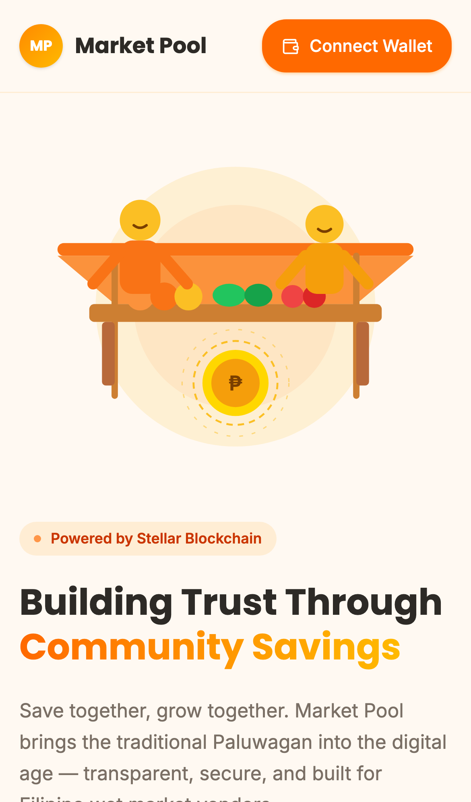
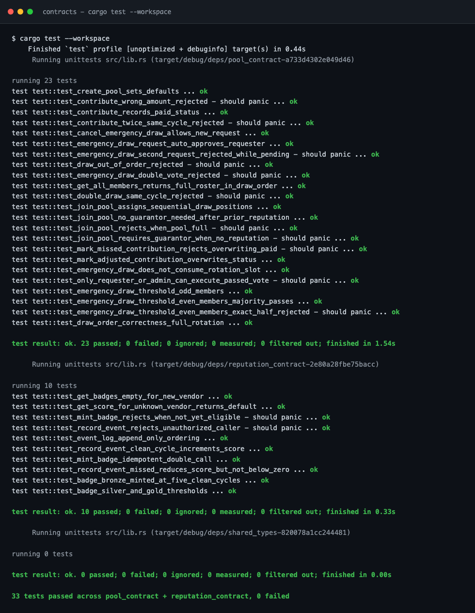
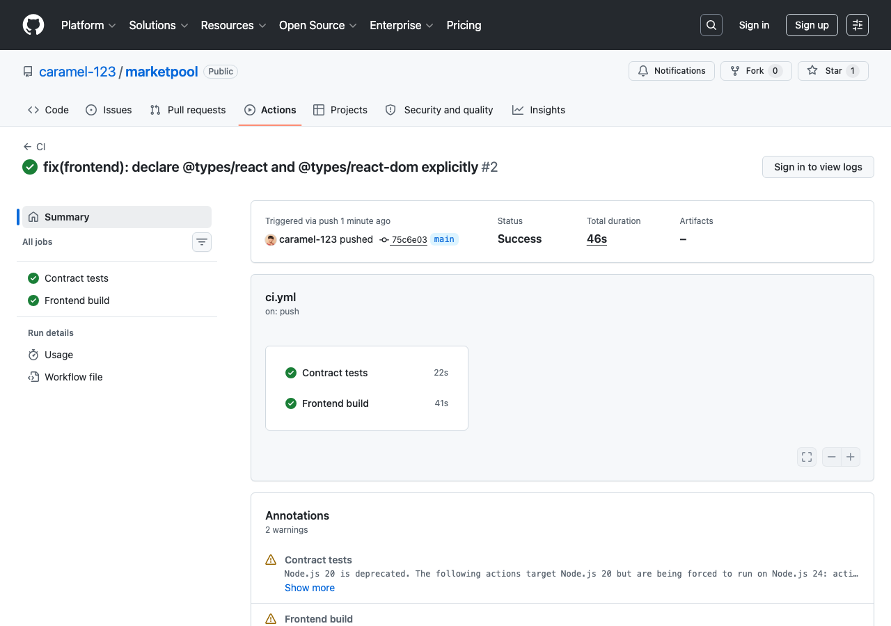

# Market Pool

**Market Pool** is a decentralized rotating savings & credit platform ("digital paluwagan") built for Filipino wet market vendors, on the **Stellar / Soroban** blockchain.

Vendors pool small, fixed contributions on a fixed schedule; each cycle, one member draws the full pot. Every contribution, draw, and reputation event is recorded on-chain — transparent, tamper-proof, and enforced by smart contracts instead of trust in a single collector.

[](https://github.com/caramel-123/marketpool/actions/workflows/ci.yml)

**Repo:** https://github.com/caramel-123/marketpool

## Table of Contents

- [Problem](#problem)
- [How it works](#how-it-works)
- [Live Demo](#live-demo)
- [Smart Contracts](#smart-contracts)
- [Architecture](#architecture)
- [Tech Stack](#tech-stack)
- [Repository Structure](#repository-structure)
- [Running Locally](#running-locally)
- [Testing](#testing)
- [CI/CD](#cicd)
- [Screenshots](#screenshots)
- [Demo Video](#demo-video)
- [Roadmap / Known Limitations](#roadmap--known-limitations)

## Problem

Wet market vendors in the Philippines commonly run informal "paluwagan" — a rotating pool where members contribute a fixed amount each cycle and one member takes the full pot in turn. It works, but it depends entirely on trust in whoever holds the cash: no transparency into who has paid, no record of missed payments, no way to verify the payout order, and no portable reputation if a vendor wants to join a *different* pool later.

## How it works

1. **Vendor connects** a Freighter wallet and joins a pool for their market (a guarantor is required for first-time participants with no on-chain reputation).
2. **Each cycle**, every member contributes the pool's fixed amount in XLM directly to the contract.
3. **The member whose turn it is** draws the full pooled amount — draw order is fixed at join time and enforced on-chain, so no one can draw out of turn or twice in the same round.
4. **Reputation accrues automatically**: on-time contributions raise a vendor's on-chain score and mint Bronze/Silver/Gold badges at 5/10/20 clean cycles; missed contributions lower it. This score is what removes the guarantor requirement for future pools.
5. **Emergency draws** let a member request an early payout, approved by a majority vote of the pool's members (threshold snapshotted when the vote opens).
6. **Kolektors** (a lightweight off-chain role) see a live queue of who has/hasn't paid for a given cycle. **Admins** create pools per market and resolve disputes.

## Live Demo

- **App:** https://marketpool-frontend.vercel.app
- **Network:** Stellar Testnet (use [Freighter](https://www.freighter.app/) set to Testnet, funded via [friendbot](https://friendbot.stellar.org))

## Smart Contracts

Two Soroban contracts, deployed to **Stellar Testnet**, written in Rust (`soroban-sdk = "25"`):

| Contract | Address | Explorer |
|---|---|---|
| `pool_contract` | `CBOURHM2D4E3BIQM57W35HYRGVXZHS5A36KZLKSAMVV2NO7AGWHPDCOK` | [View on Stellar Expert](https://stellar.expert/explorer/testnet/contract/CBOURHM2D4E3BIQM57W35HYRGVXZHS5A36KZLKSAMVV2NO7AGWHPDCOK) |
| `reputation_contract` | `CDGWOE3IE35VDIE43STXBV5332AZJLDR3XUPPRVFI77EGYPJT7CBG4WN` | [View on Stellar Expert](https://stellar.expert/explorer/testnet/contract/CDGWOE3IE35VDIE43STXBV5332AZJLDR3XUPPRVFI77EGYPJT7CBG4WN) |

Full deployment record (deployer address, wiring status): [`contracts/deployments/testnet.json`](contracts/deployments/testnet.json).

**Sample on-chain transaction** (`create_pool` invocation on `pool_contract`):

- Hash: `b52d50e9c5b16fe9be068e73ade79f700397a58a7e281445dadec0b2bd64ff80`
- [View on Stellar Expert](https://stellar.expert/explorer/testnet/tx/b52d50e9c5b16fe9be068e73ade79f700397a58a7e281445dadec0b2bd64ff80)

### `pool_contract`
`create_pool`, `join_pool` (guarantor-gated for first-time vendors), `contribute` (exact amount only), `request_draw` / `execute_draw` (rotation, double-draw guarded), `request_emergency_draw` / `approve_emergency_draw` / `cancel_emergency_draw` (majority vote, threshold snapshotted at open), `mark_missed_contribution` / `mark_adjusted_contribution`, `get_all_members`.

### `reputation_contract`
`record_event` (allow-listed caller only — only `pool_contract` may write), `get_score`, `get_badges`, `mint_badge` (idempotent), `get_event` / `get_event_count`.

## Architecture

```
┌─────────────┐      Freighter (sign)       ┌──────────────────────┐
│   Browser    │ ───────────────────────────▶│  Stellar Testnet RPC  │
│  React app   │◀─────────────────────────── │  pool_contract         │
│              │      simulate / read         │  reputation_contract   │
└──────┬───────┘                              └──────────────────────┘
       │  wallet-signed JWT (SEP-53 challenge)
       ▼
┌─────────────────────┐
│      Supabase        │   markets / vendors / kolektor_logs /
│  Postgres + RLS +     │   pool_metadata / dispute_reports
│  Edge Function        │   (off-chain data, wallet-scoped RLS)
└─────────────────────┘
```

On-chain contracts are the source of truth for money movement, draw order, and reputation. Supabase holds off-chain metadata (market/pool listings, kolektor logs, dispute reports) behind Row Level Security policies keyed to the connected wallet's address via a custom JWT claim minted through a Freighter `signMessage` challenge (no passwords).

## Tech Stack

- **Contracts:** Rust, Soroban SDK 25, Stellar CLI
- **Frontend:** React 18.3 + Vite 6.3 + TypeScript, Tailwind CSS 4 (CSS-first, `@tailwindcss/vite`), shadcn/ui, React Router 7
- **Wallet:** `@stellar/freighter-api`, `@stellar/stellar-sdk`
- **Backend:** Supabase (Postgres, RLS, Edge Functions)
- **Hosting:** Vercel

## Repository Structure

```
contracts/            Rust/Soroban workspace
  shared_types/        shared enums/structs used by both contracts
  pool_contract/        rotation, contributions, draws, emergency votes
  reputation_contract/  score, badges, event log
  deployments/          recorded testnet deployment addresses
  scripts/               demo-pool seed script
frontend/             React + Vite app
  src/app/
    contracts/          contract service layer (build/sign/submit, read simulation)
    context/            wallet + session state
    data/                typed Supabase repo modules
    pages/               vendor / kolektor / admin pages
supabase/
  functions/stellar-login/   wallet-signature → Supabase JWT exchange
  seed/                        demo market/pool seed SQL
```

## Running Locally

### Contracts
```bash
cd contracts
cargo test --workspace          # run all unit tests
stellar contract build          # build wasm
```

### Frontend
```bash
cd frontend
npm install --legacy-peer-deps
cp .env.example .env            # fill in Supabase + contract IDs
npm run dev
```

Required environment variables (see [`frontend/.env.example`](frontend/.env.example)): Supabase URL/anon key, Soroban RPC URL, network passphrase, deployed contract IDs, and a public read-only account used for pre-wallet-connect simulations.

## Testing

33 unit tests across the two contracts, all passing:

```
$ cargo test --workspace
...
running 23 tests   (pool_contract)
test result: ok. 23 passed; 0 failed; 0 ignored; 0 measured; 0 filtered out

running 10 tests   (reputation_contract)
test result: ok. 10 passed; 0 failed; 0 ignored; 0 measured; 0 filtered out
```

Coverage includes: sequential draw-position assignment, guarantor gating, exact-amount contribution enforcement, full rotation correctness, double-draw guards (same cycle *and* same position), emergency-vote threshold math (even/odd member counts, exactly-50% rejected), double-vote rejection, badge idempotency, unauthorized-caller rejection on `record_event`, and zero-value defaults for unknown vendors.

## CI/CD

GitHub Actions runs on every push/PR: `cargo test --workspace` for both contracts, and `npm run build` for the frontend. See [`.github/workflows/ci.yml`](.github/workflows/ci.yml) and the **Actions** tab of this repo for run history.

## Screenshots

**Mobile responsive UI:**



**Desktop, showing live platform stats pulled from Supabase + on-chain reads:**


**Contract test run (33/33 passing):**



**CI/CD pipeline:**



## Demo Video

<!-- TODO: add a 1–2 minute demo video link (YouTube/Loom) walking through: connect wallet → join a pool → contribute → view dashboard → reputation/badges → admin pool creation -->

## Roadmap / Known Limitations

- Leaving a pool mid-rotation is not supported in v1.
- Guarantor vouching is informational only — a vouched vendor's defaults don't currently penalize the guarantor's score.
- Kolektor cash-logging is off-chain only; on-chain `mark_missed_contribution` / `mark_adjusted_contribution` remain admin-signed.
- Contributions must be paid in the exact pool amount (no partial payments); reconciliation happens via `mark_adjusted_contribution`.

---

Built for the **Monthly Builder** hackathon.
